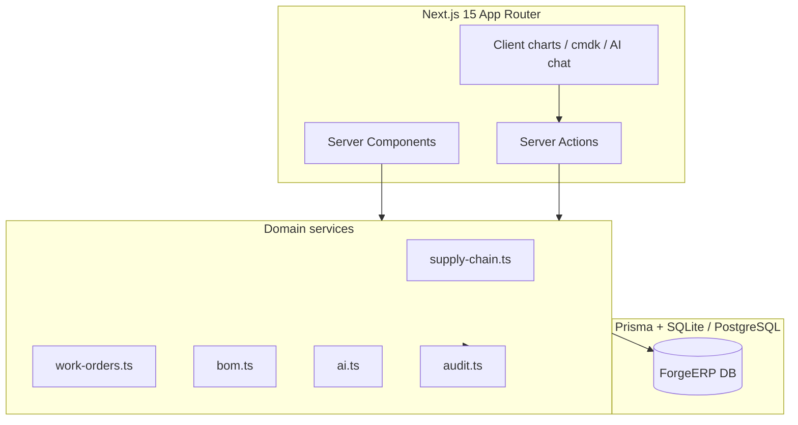
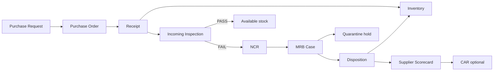
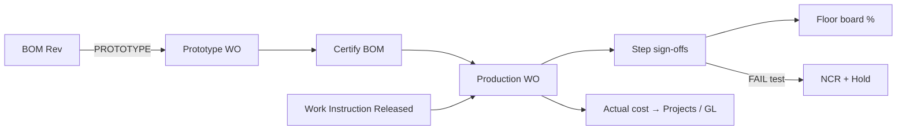

# ForgeERP

**Integrated manufacturing ERP** for high-reliability environments (aerospace, defense, precision assembly). Built as a single cohesive **Next.js 15** application with dark navy/slate UI, teal/amber status accents, shop-floor tablet support, and large-screen information radiators.

  

---

## Quick start (one command after install)

```bash
npm install
npm run setup      # prisma generate + db push + rich seed
npm run dev        # http://localhost:3000
```

Optional reset anytime:

```bash
npm run db:reset
```

### PostgreSQL path

```bash
docker compose up -d
# set DATABASE_URL from .env.postgres.example
# change prisma/schema.prisma datasource provider to "postgresql"
# use @prisma/adapter-pg instead of better-sqlite3 in src/lib/db.ts
npm run setup
```

---

## Modules

| Area | Routes | Highlights |
|------|--------|------------|
| Command center | `/` | Cross-module KPIs, EVM strip, quality alerts |
| Production floor | `/floor` | Color-coded WO tiles, capacity load, sign-off % |
| Info radiators | `/radiators` | Large-font wall display, auto-refresh |
| Value stream | `/value-stream` | Supplier→Ship live flow + constraints |
| Work orders | `/work-orders` | Production / prototype / task-only + travelers |
| Work instructions | `/work-instructions` | CM workflow Draft→Eng→CM→Released |
| BOM / Parts | `/bom` | Multi-rev, prototype banner, certify, where-used |
| Config management | `/cm` | ECR board votes, impact analysis |
| Purchasing | `/purchasing` | PR→PO→Receive (pass/fail→MRB) |
| Suppliers | `/suppliers` | Live scorecards (OTD, PPM, cost) |
| Inventory | `/inventory` | Multi-loc, ownership, quarantine |
| Quality / NCR | `/quality` | Inspections, NCR trends, yield |
| MRB | `/mrb` | Disposition → inventory + scorecard |
| Shipping | `/shipping` | SO + packing / ship status |
| Gov property | `/government-property` | GFP/CAP, UID, DFARS checks |
| Projects | `/projects` | WBS, SPI/CPI, risks, issues, linked WOs |
| Accounting | `/accounting` | GL, P&L, BS, TB, AR/AP, WO variance |
| Engineering | `/engineering` | JIRA-style board |
| HR | `/hr` | Time, PTO, expenses, reviews, AI goal tips |
| AI assistant | `/ai` | Local assistant; optional Grok API |

**⌘K / Ctrl+K** — global command palette.

---

## Architecture overview







---

## How major integrations work

### 1. Purchasing → Receipt → Inspection → MRB → Inventory → Scorecard

Implemented in `src/lib/services/supply-chain.ts` and wired from **Purchasing** UI:

1. **PR** submitted → approved → **Convert to PO**
2. **Receive (Pass QA)** or **Receive (Fail → MRB)** on open POs
3. Receipt updates PO line qty + PO status (`PARTIAL_RECEIPT` / `RECEIVED`)
4. Stock posts to **Receiving** location; material transaction `RECEIPT` logged
5. **Incoming inspection** auto-created with characteristics
6. On **FAIL**: NCR + MRB case, inventory moved to **QUARANTINE**, available qty → 0, `mrbCaseId` set
7. MRB disposition (`USE_AS_IS` / `REWORK` / `SCRAP` / `RETURN_TO_SUPPLIER` / `REPAIR`) releases or scraps stock and may open a **CAR**
8. **`updateSupplierScorecard`** recomputes OTD (receipt vs promise), quality PPM (NCR qty / received), overall rating A–F and writes **scorecard history**

### 2. BOM → Work Instruction → Work Order → Floor sign-offs

- BOMs: `DRAFT` / `PROTOTYPE` / `IN_REVIEW` / `CERTIFIED` / `OBSOLETE`
- **Production WOs** may only attach **CERTIFIED** BOMs; prototype builds use type `PROTOTYPE`
- **Certify** locks the rev, clears prototype flag, and **obsoletes** prior certified revs for that part
- Released **Work Instructions** (CM path: Draft → Engineering → CM → Released) attach to WOs; steps become `WorkOrderStepCompletion` rows
- Operator **Sign Off** (incl. test pass/fail + measured values) writes sign-off records, audit log, updates floor progress; **FAIL** opens NCR and can hold the WO

### 3. Projects / EVM and accounting

- Projects store PV / EV / AC; UI computes **SPI = EV/PV**, **CPI = EV/AC**
- WOs link to project + WBS; actual cost feeds program and **Accounting** cost variance (actual vs standard)
- Seed includes journal entries, AR/AP, chart of accounts, budgets

### 4. Government property

- Assets with UID, contract, custodial code, DFARS flag, and compliance checklist events
- Linked inventory rows use `ownership: GOVERNMENT` (visual violet strip)

### 5. AI assistant

- Default: context-aware **local** responses over live DB metrics (`src/lib/services/ai.ts`)
- Upgrade: set `XAI_API_KEY` → calls xAI Chat Completions with plant JSON context (tool-calling ready)

---

## Tech stack

- **Next.js 15** App Router, Server Components, Server Actions  
- **TypeScript** strict  
- **Prisma 7** + **SQLite** (`better-sqlite3` adapter) / Docker **PostgreSQL**  
- **Tailwind CSS 4** + shadcn-style Radix primitives  
- **TanStack Table**, **Recharts**, **date-fns**, **lucide-react**, **jsPDF**, **xlsx**, **fuse.js**, **sonner**, **cmdk**, **zod**, **react-hook-form**, **framer-motion**, **dnd-kit**

---

## Project layout

```
prisma/
  schema.prisma      # Full manufacturing domain model
  seed.ts            # Rich integrated demo data
src/
  app/               # Routes per module + server actions
  components/        # UI, layout, charts, shared
  lib/
    db.ts            # Prisma client (SQLite adapter)
    audit.ts         # Audit logging
    auth.ts          # Demo role-based user
    services/        # Supply chain, WO, BOM, AI
    pdf.ts           # Branded PDF helpers
    utils.ts         # cn, formatters, status colors, EVM
docker-compose.yml
```

---

## Order-to-ship fulfillment flow

```
Sales Order (required date)
    → Stock check finished goods  (or Bypass stock → order full demand / full BOM)
        → allocate if available
        → else Work Order (BOM + WI digital traveler, due date schedule)
            → BOM material check
                → short (or bypass)? auto Purchase Request
                → PR multi-step approval (threshold policy) → Convert to PO
                → Receiving traveler on PO issue
                → Receive: per-line qty (partial OK) + photos + putaway location
                    → partial? child traveler for remainder
                    → all lines received → Close PO from receiving
            → Ready to kit → Kit order (travels with WO)
            → Kit complete → Start production → step sign-offs
            → Complete → FG to stock
    → READY_TO_SHIP (respects allowEarlyShip / shipNotBefore)
    → Shipping pull & ship (inventory + lot/serial trace)
```

| Route | Role in flow |
|-------|----------------|
| `/sales` | Create SO, plan fulfillment (optional **bypass stock**), ship gate |
| `/purchasing` | PR multi-step approve → PO; **keyword search** all POs past/present |
| `/purchasing/approvals` | Configure PR threshold approvers / steps |
| `/receiving` | Dock travelers; partial receive, photos, putaway area, child remainders |
| `/inventory` | Stock by location · lot/serial trace · quarantine |
| `/kitting` | Create / complete kit for traveler |
| `/work-orders/[id]` | Digital traveler, material (bypass BOM stock), kit, sign-off, complete |
| `/shipping` | Pull queue & confirm ship |

Every step writes **TraceEvent** + material transactions for genealogy.

### PR approval (configurable)

Default policy (seeded, editable at `/purchasing/approvals`):

1. **Buyer review** — all PRs (role `PURCHASING`)
2. **Finance / controller** — estimate ≥ $5,000 (`ACCOUNTING`)
3. **Operations admin** — estimate ≥ $25,000 (`ADMIN`)

Steps below a PR’s dollar amount are skipped. Switch `DEMO_USER_ROLE` to walk steps as different roles; `ADMIN` can always approve.

### Receiving partials

On the traveler, enter only the qty that arrived, attach dock photos, and **must select a stock location**. Material inspects then putaways there. Open remainder spawns a **child traveler**. **Close PO** is enabled only when every line is fully received.

## Seed scenarios to click through

1. **Sales** `SO-00002` → **Plan fulfillment** → WO + shortage PR → approve/convert/receive → **Put away** on Inventory → **Kitting** → start production → complete → ship  
2. **BOM** `ASM-1000` Rev C **PROTOTYPE** → create Prototype WO → **Certify** after FAI story  
3. **WO-00001** traveler → sign remaining test steps on the floor  
4. **PO-00003** → **Receive (Fail → MRB)** → dispose on **MRB** page → watch **supplier** score move  
5. **Value Stream** — MRB stage shows **constraint** while holds open  
6. **Projects** `PRJ-AERO-01` — SPI/CPI and linked WOs  
7. **CM** `ECR-00001` — cast board votes  
8. **Radiators** — full-screen plant board  
9. **AI** — “Summarize open MRB cases”

---

## Production roadmap

| Phase | Focus |
|-------|--------|
| **Auth** | NextAuth / Clerk / SSO; enforce RBAC matrix in `auth.ts` on every action |
| **Jobs** | Queue (BullMQ / Inngest) for scorecard recompute, email, PDF batch, MRP |
| **Files** | S3-compatible storage for drawings, inspection photos, traveler attachments |
| **DB** | PostgreSQL primary; read replicas; row-level security for multi-site |
| **Realtime** | WebSockets / SSE for floor & radiators instead of poll refresh |
| **AI** | Grok tool calling: `receivePo`, `dispositionMrb`, `listOpenHolds`, etc. |
| **MES** | Barcode/RFID scan endpoints, device auth, offline tablet sync |
| **Compliance** | Electronic signature 21 CFR Part 11-style, export packages for DCMA |
| **Observability** | OpenTelemetry, structured audit export, SIEM sink |
| **Hardening** | Rate limits, CSRF on actions, secrets manager, backup/DR drills |

---

## Scripts

| Command | Description |
|---------|-------------|
| `npm run setup` | Generate client, push schema, seed |
| `npm run db:reset` | Wipe DB + reseed |
| `npm run db:studio` | Prisma Studio |
| `npm run dev` | Dev server (Turbopack) |
| `npm run build` | Production build |

---

## License

Proprietary demo / prototype — adapt for your organization.
